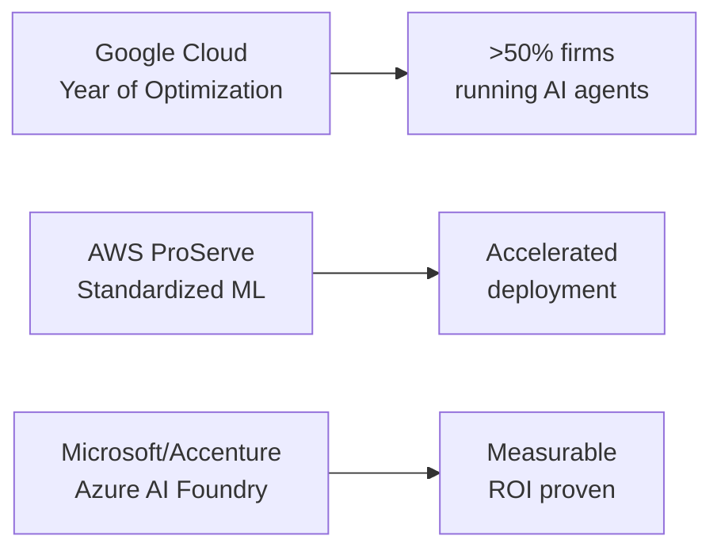
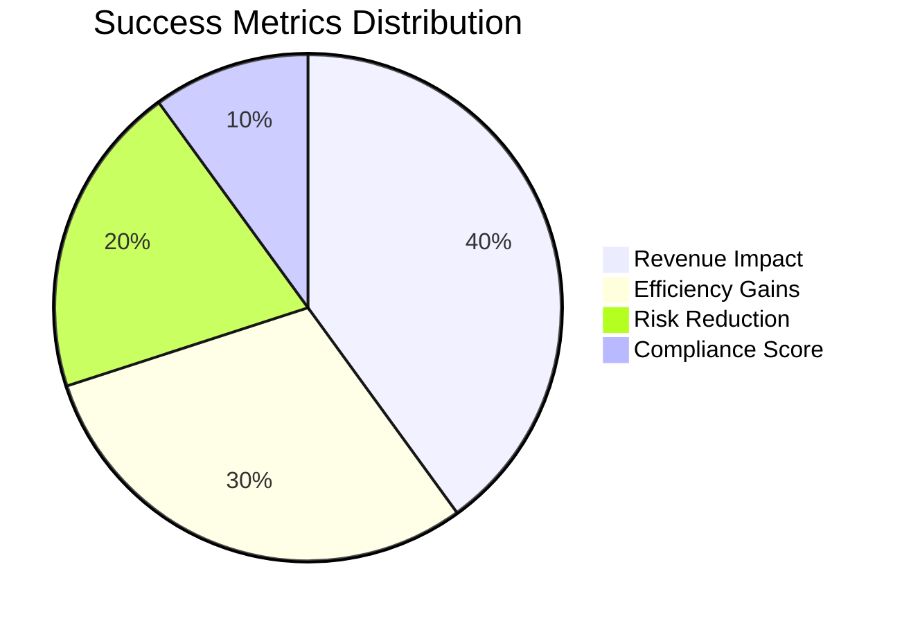
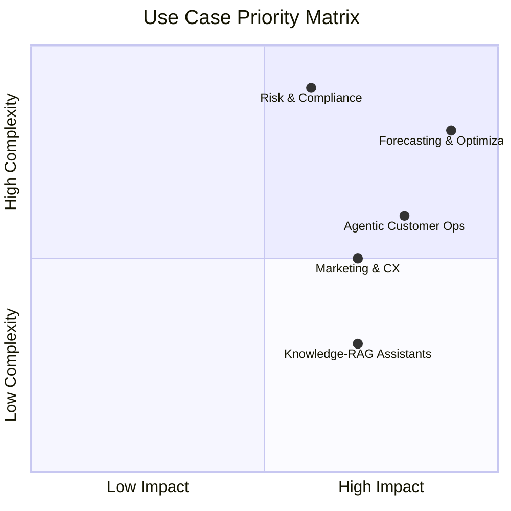
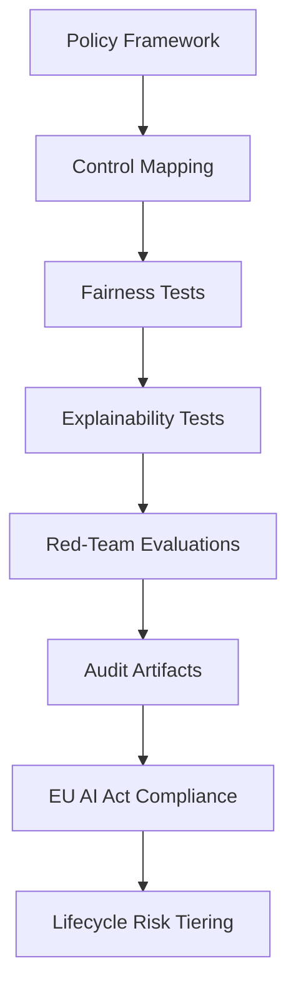
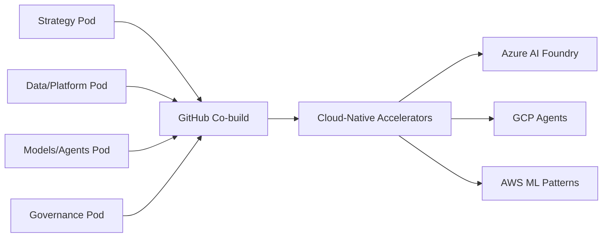
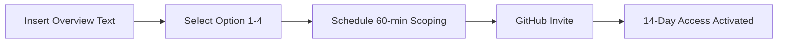

# 🚀 AI Consulting Excellence 2025
> **Enterprise-Grade AI Transformation Services**

## 🎯 Executive Context & Offerings

### ⏱️ **14-Day Premium Access**
- 🔐 **Private GitHub Repository** with enterprise assets
- 🏗️ **Architecture Templates** (IaC/MLOps ready)
- 📊 **Jupyter Notebooks** & reusable accelerators
- 🤝 **Issue-driven collaboration** & PR reviews
- 📝 **Real-time doc co-editing** for seamless handoff

---

> **📋 Client Overview: Medical SaaS Transformation**
>
> **Challenge:** Healthcare organizations struggle with complex medical terminology that creates communication barriers between providers and patients, leading to reduced comprehension, compliance issues, and patient satisfaction concerns.
>
> **AI Solution Delivered:** Developed an intelligent Medical SaaS platform that automatically translates complex medical conversations into patient-friendly language, enhanced with text-to-speech accessibility features for improved patient engagement.
>
> **Business Impact:**
> - ✅ **Patient Comprehension**: Simplified medical explanations using middle-school reading level translations
> - ✅ **Accessibility**: Integrated audio capabilities for diverse patient needs
> - ✅ **Clinical Efficiency**: Automated translation reduces provider explanation time
> - ✅ **Compliance Ready**: Authentic medical terminology linked to trusted healthcare sources
>
> **Portfolio Example:** [Medical SaaS Implementation](./A.I%20Consulting%20-%20Medical%20SaaS.md) - Live demonstration of patient-friendly medical conversation translation with interactive audio features.

## 🏆 Why This Proposal: Best-in-Class 2025 Benchmarks

| **Consulting Leader** | **Key Differentiator** | **Proven Impact** |
|:---:|:---:|:---:|
| 🎯 **McKinsey QuantumBlack** | Scaling GenAI beyond pilots | Proven frameworks to embed AI in operating models |
| 🔒 **Accenture** | Responsible AI by design | Azure AI Foundry: 20% cost reduction, 50% faster build |
| 🏅 **Deloitte** | 2025 IDC MarketScape Leader | Analytics + automation + AI for enterprise outcomes |
| 📈 **Bain & Co.** | Industry-specific playbooks | Accelerated revenue & retention via tailored use cases |
| 🤖 **IBM Consulting** | watsonx studio governance | End-to-end AI services with lifecycle management |

### ☁️ **Cloud Innovation Trends 2025**

> **📊 Source:** Industry reports and web sources indicate 2025 as the inflection point for enterprise AI adoption

## 🎯 Objectives & Success Criteria

| **Objective** | **Success Metric** | **Timeline** |
|:---:|:---:|:---:|
| 📊 **Measurable Impact** | Revenue, efficiency, risk reduction from 2-3 prioritized AI use cases | 8-12 weeks |
| 🛡️ **Production-Grade AI** | SLAs, monitoring, human-in-the-loop guardrails | Ongoing |
| ⚖️ **Compliance Ready** | EU AI Act & Responsible AI frameworks alignment | Built-in |

### 🎯 **Key Performance Indicators**

## 📋 Scope of Work: Phased Approach

```mermaid
gantt
    title AI Transformation Roadmap
    dateFormat  X
    axisFormat %s
    
    section Strategy Phase
    Executive Workshops    :0, 2
    KPI Alignment         :1, 2
    Platform Fit Analysis :1, 2
    
    section Architecture Phase
    Data Lakehouse        :1, 4
    Feature Store         :2, 4
    MLOps Pipelines      :2, 4
    Security Model        :3, 4
    
    section Pilot Phase
    RAG Pilot Build      :3, 6
    Agentic Workflow     :4, 6
    Red-Team Testing     :5, 6
    Production Hardening :6, 8
    
    section Scale Phase
    Playbook Creation    :6, 10
    Team Training        :7, 10
    Optimization         :8, 12
    CoE Charter          :10, 12
```

### 🚀 **Phase Breakdown**

<table>
<tr>
<td width="25%">

#### 🎯 **Phase 1: Strategy**
**Weeks 0-2**
- Executive workshops
- KPI alignment
- Platform fit analysis

</td>
<td width="25%">

#### 🏗️ **Phase 2: Architecture**
**Weeks 1-4**
- Lakehouse/feature store
- MLOps pipelines
- Security model

</td>
<td width="25%">

#### 🧪 **Phase 3: Pilot**
**Weeks 3-8**
- RAG + agentic pilots
- Red-teaming
- Production hardening

</td>
<td width="25%">

#### 📈 **Phase 4: Scale**
**Weeks 6-12**
- Playbooks & training
- Optimization
- CoE charter

</td>
</tr>
</table>

## 🎛️ Use-Case Menu

| **Use Case** | **Description** | **Impact** | **Complexity** |
|:---:|:---:|:---:|:---:|
| 🤖 **Agentic Customer Ops** | Ticket triage & resolution with human oversight | High efficiency gains | Medium |
| 📚 **Knowledge-RAG Assistants** | Policy-grounded, explainable workforce answers | Reduced training time | Low-Medium |
| 📊 **Forecasting & Optimization** | Demand prediction, dynamic pricing | Revenue optimization | High |
| ⚖️ **Risk & Compliance** | Audit-ready AI, fairness monitoring | Risk reduction | High |
| 🎯 **Marketing & CX** | Personalized experiences, omnichannel | Customer satisfaction | Medium |

### 🔄 **Implementation Priority Matrix**

## 🛡️ Governance & Responsible AI (Embedded)

### 🔒 **Compliance Framework**

<table>
<tr>
<td width="33%">

#### 📋 **Policy-to-Control Mapping**
- Automated policy translation
- Control implementation tracking
- Compliance dashboard

</td>
<td width="33%">

#### 🧪 **Testing & Evaluation**
- Fairness/explainability tests
- Red-team evaluations
- Continuous monitoring

</td>
<td width="33%">

#### 📊 **Audit & Reporting**
- Regulator-ready artifacts
- Lifecycle risk tiering
- EU AI Act compliance

</td>
</tr>
</table>

> **⚖️ Built-in Compliance:** EU AI Act readiness with automated monitoring and reporting

## 🚀 Delivery Model

### 👥 **Agile Pod Structure**

<table>
<tr>
<td width="25%">

#### 🎯 **Strategy Pod**
- Executive alignment
- KPI definition
- Value mapping

</td>
<td width="25%">

#### 🏗️ **Data/Platform Pod**
- Architecture design
- MLOps pipelines
- Security implementation

</td>
<td width="25%">

#### 🤖 **Models/Agents Pod**
- AI model development
- Agent workflows
- Performance optimization

</td>
<td width="25%">

#### 🛡️ **Governance Pod**
- Compliance framework
- Risk management
- Audit preparation

</td>
</tr>
</table>

### ⏱️ **Timeline Overview**

| **Phase** | **Duration** | **Key Deliverables** |
|:---:|:---:|:---:|
| 🎯 **Strategy & POV** | Weeks 0-2 | Executive workshops, KPI alignment |
| 🏗️ **Architecture & MLOps** | Weeks 1-4 | Baseline infrastructure, pipelines |
| 🧪 **Pilot(s) Live** | Weeks 3-8 | Working prototypes, testing |
| 📈 **Scale & CoE Launch** | Weeks 6-12 | Optimization, training, handoff |

## 📦 Deliverables

### 📋 **Deliverable Checklist**

- [ ] **Strategy Pack**
  - [ ] Value Map
  - [ ] KPIs
  - [ ] Risk Posture
- [ ] **Architecture & IaC**
  - [ ] Cloud-Native
  - [ ] Vendor-Agnostic
- [ ] **RAI Governance Kit**
  - [ ] Policies
  - [ ] Tests
  - [ ] Audit Templates
- [ ] **Production Use Cases**
  - [ ] RAG Implementation
  - [ ] Agent Workflow
- [ ] **Documentation**
  - [ ] Runbooks
  - [ ] Dashboards
  - [ ] Hand-off Docs

## 🎯 Next Steps

### ✅ **Action Items**

1. **📝 Insert your {Overview} text** to finalize client alignment
2. **🎯 Select Option 1–4** based on your needs
3. **📅 Schedule 60-min scoping** + GitHub invite (activates 14-day access)

---

## 💼 Next Steps & Pricing Options

<table>
<tr>
<td width="50%">

### 🔄 **Option 1: Continue Access**
**Subscription/Retainer Model**
- ✅ Keep proposal & GitHub workspace active
- ✅ Ongoing collaboration & updates
- ✅ Priority support & maintenance

</td>
<td width="50%">

### 🏆 **Option 2: Own It Outright**
**One-Time Purchase**
- ✅ Full ownership/IP transfer
- ✅ Complete asset library
- ✅ Unlimited usage rights

</td>
</tr>
<tr>
<td width="50%">

### 🎓 **Option 3: Further Consulting**
**Extended Scope**
- ✅ Workshops & deep dives
- ✅ Vendor selection guidance
- ✅ Strategic planning sessions

</td>
<td width="50%">

### 🚀 **Option 4: Build & Implement**
**Full Development**
- ✅ Complete implementation
- ✅ Production deployment
- ✅ Training & handoff

</td>
</tr>
</table>

> **💰 Pricing:** All options follow the same cost structure approach with milestone-based payments

---

## 💰 Commercials (USD — tied to Options)

| **Option** | **Model** | **Pricing Structure** |
|:---:|:---:|:---:|
| 🔄 **Option 1** | Continue Access | Most appropriate USD retainer |
| 🏆 **Option 2** | Own It Outright | One-time most appropriate USD |
| 🎓 **Option 3** | Further Consulting | Same cost structure as 1 & 2 |
| 🚀 **Option 4** | Build & Implement | Same cost structure as 1–3 (milestone-based) |

---

**🚀 Ready to Transform Your AI Strategy?**

